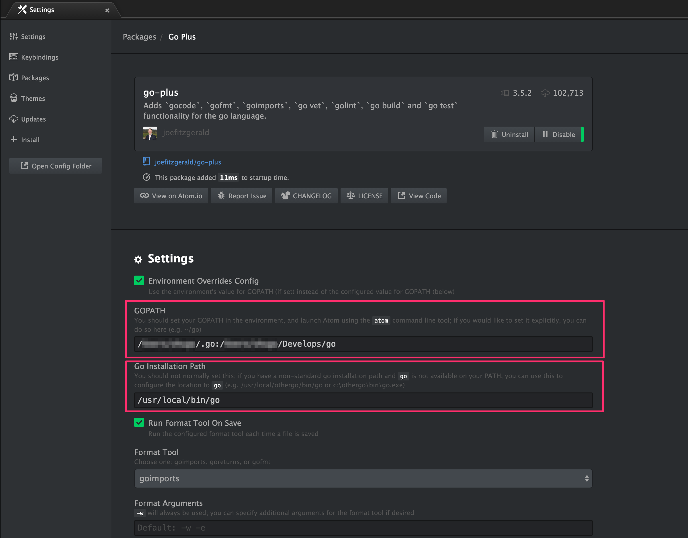

golang on MacOSXチュートリアル width atom editor
==============================================

goには[gom](https://github.com/mattn/gom)、[godep](https://github.com/tools/godep)や[その他のパッケージ依存管理ツール](https://github.com/golang/go/wiki/PackageManagementTools)や、[gvm](https://github.com/moovweb/gvm)のように、複数の環境を同居させる仕組み（rubyでは[rbenv](https://github.com/rbenv/rbenv)や[rvm](https://rvm.io/)）が存在しますが、今回はそちらの仕組みは考慮せずに構築します。また、機能網羅、機能説明するのを目的とはしていなく、どのように開発を始めるかに重点を置いていますので、そのあたりをご理解いただければと思います。

本編でもところどころ出てきますが、[A Tour of Go](http://go-tour-jp.appspot.com/)はとても簡単なチュートリアルです。一度見に行っても損はしないと思います。

1. goのインストール
----------------

[homebrew](http://brew.sh/index_ja.html)を使っていれば簡単です。

```
$ brew install go
```

2. $GOPATHの設定
----------------
様々な設定があり、本番環境や開発環境などで異なってくると思いますが以下のように設定しています。

```
$ cat ~/.bash_profile

export GOPATH=~/.go:~/Develops/go
export PATH=$PATH:${GOPATH//://bin:}/bin

```

上記設定では以下の様な役割をもたせます

| path | 役割      |
| ---- | -------- |
| ~/.go | `go get` を使用して取得したパッケージの格納（サードパーティ製） |
| ~/Develops/go | 自分で開発するgoのパッケージを格納（自作） |


> ただしこれには議論があり、$GOPATHは１つが良いともいわれています（私も一般的にはそうだと思います。）が、冒頭でもも記述したように本番環境や開発環境によって違ったり、開発プロジェクトごとにgvmなどで設定を変えるほうが依存関係は綺麗に保たれると思うので、その時にあった方法を選んでいただければと思います。

3. エディタの用意
---------------

[IntelliJ](https://www.jetbrains.com/idea/)のほうがデバッガを使用しステップ実行が行えるようなので便利そうですが、今回は個人的に[atom](https://atom.io/)が好きなので、atomで進めて行こうと思います。

プラグインは[go-plus](https://atom.io/packages/go-plus)と[autocomplete-go](https://atom.io/packages/autocomplete-go)を入れると良いでしょう

```
$ apm install go-plus autocomplete-go # atomプラグインのインストール
$ go get -u github.com/nsf/gocode # goの依存パッケージを入手
```

また、go-plusプラグインの設定を以下の２点、埋める必要があります。



設定が終わったら、atomを再起動する必要があります。


4. HelloWorld
--------------

どこのディレクトリでも良いので、 `helloworld.go` ファイルを作成し、以下のプログラムをatomを使用してコピペし保存してください。

```
package main

func main() {
fmt.Println("Hello world")
}
```

atomの補助機能でimportが追加され、インデントなども解消されたかと思います。これは標準パッケージや、$GOPATH以下にあるライブラリであれば補完してくれるので、非常に助かります。

> 補助機能が動作せず、import文が自動で挿入されない場合は、go-plusの$GOPATHの設定がうまく行っていない可能性があります。

次に実行します。

```
$ go run helloworld.go
```

`Hello world`と出力されれば完了です。


5. go getでのパッケージ取得
----------------------------

[ushios/gotorial](https://github.com/ushios/gotorial)にチュートリアル用のパッケージを用意しました。
```
$ go get github.com/ushios/gotorial
```

[Add関数](https://github.com/ushios/gotorial/blob/master/calc/add.go#L4-L8)と[threeAdd関数](https://github.com/ushios/gotorial/blob/master/calc/add.go#L10-L13)と存在しているのが見てわかると思います。

### パッケージ内の関数の仕様

以下の一行で、パッケージの関数を使用することができます。

```
fmt.Println(calc.Add(24, 34))
```

インポート文を書く必要はありません。簡単ですね。
以下のようになったかと思います。

```
package main

import (
	"fmt"

	"github.com/ushios/gotorial/calc"
)

func main() {

	fmt.Println("hello world")

	fmt.Println(calc.Add(24, 34))
}
```

### 頭文字が小文字の場合は外部からアクセス出来ない

ここで、threeAdd関数を使ってみます。

```
package main

import (
	"fmt"

	"github.com/ushios/gotorial/calc"
)

func main() {

	fmt.Println("hello world")

	fmt.Println(calc.threeAdd(24, 34, 52))
}

```

残念ながらこれはエラーになります。

> 詳しくは[A Tour of Go - Exported names](http://go-tour-jp.appspot.com/basics/3)を見てください。

6. 関数の宣言
------------
以下の関数は、渡された２つの引数で割り算を行う関数です。たとえば、[ushios/gotorial - calc/div.go](https://github.com/ushios/gotorial/blob/master/calc/div.go#L6-L14)にはたくさんのgoの要素が含まれています。例えば、下記の関数の宣言ですが

```
6| // Divison is division two ints.
7| func Division(a int, b int) (div int, err error) {
8|     if b <= 0 {
```
引数はもちろんのこと、返り値を複数指定している上に、先頭で変数の宣言もできます。

`func 関数名(引数1, 引数2 ...) (返値1, 返値2 ...) { 処理 }`

しかしこれは[A Tour of Go - Named return values](http://go-tour-jp.appspot.com/basics/7)でも説明されている通り、短い関数でのみ使用するべきです。またこのような指定方法もあります。

その関数使用例は、[divisionのテスト](https://github.com/ushios/gotorial/blob/master/calc/div_test.go#L5-L19)でもありますが

```
 9|
10|    div, err := Division(a, b)
11|
```
このように、返り値を２つ受け取っているのがわかると思います。また、宣言した変数はどこかで使用しなければならないというgoの制限のため、エラーチェックは忘れずに必ず行われるという強制力が加わります。

> 他の詳しいフォーマットについては[A Tour of Go Functions](http://go-tour-jp.appspot.com/basics/4)と[A Tour of Go Functions continued](http://go-tour-jp.appspot.com/basics/5)をご覧ください。

### 返り値を破棄することによるエラーチェックの回避

`_（アンダースコアー）`を使うことによって、変数を破棄することができます。変更後のものは[こちらのテスト](https://github.com/ushios/gotorial/blob/master/calc/div_test.go#L21-L31)に記述してあります。


7. 変数の宣言
------------

### varを使用した宣言

下記は２つの変数を`bool`値として宣言しています。詳細は[A Tour of Go - Variables](http://go-tour-jp.appspot.com/basics/8)を御覧ください。
```
var flag1, flag2 bool
```

### 演算子`:=`を使用した型宣言
また、今まで何回も出てきましたが、`:=`この記号の組み合わせには大きな意味があります。[A Tour of Go - Short variable declarations](http://go-tour-jp.appspot.com/basics/10)にもある通り、暗黙的な型宣言が行われます。

```
var num int = 10
```
と

```
num := 10
```
は、等価といえます。

> 詳細は[A Tour of Go - Short variable declarations](http://go-tour-jp.appspot.com/basics/10)を御覧ください。また、[:= 演算子をなんと呼ぶのか問題](http://moznion.hatenadiary.com/entry/2015/02/25/173406)という議論がとても気になります。

8. 開発を始める
--------------
先ほど`go get`を使って、[ushios/gotorial](https://github.com/ushios/gotorial)を`~/.go/src/github.com/ushios/gotorial`へ取得してきたと思います。このままgotorialのソースを拡張して行っても良いのですが、良い選択とは思えません。ですので今度は、パッケージを作り始めたいと思います。

### プロジェクトディレクトリの作成

githubを使う前提で話を進めますが、bitbucketでも似たような構成でプライベートリポジトリを使用して行えると思います。
いままでの`~/.go`から始まる$GOPATHは`go get`用に用意したもので、開発するものは他のディレクトリに分けておきたいという理由で、$GOPATHは２つ設定しておきましたが、そのもう片方(`~/Develops/go`)を使う時がやって来ました。

まず、パッケージにあったディレクトリを作成します。

```
$ mkdir -p ~/Develops/go/src/github.com/{$username}/{$packagename}
```
（以下は、`ushios/packago`とします。）

になります。

### 関数を実装する

それでは適当に関数を実装していこうと思います。[packago/text.go](https://github.com/ushios/packago/blob/master/text.go)を先ほど作成したディレクトリの下（~/Develops/go/src/github.com/ushios/packago/text.go）に作成しました。

``` 
package packago

import "fmt"

func Concat(a string, b string) string {
	var text string
	text = fmt.Sprintf("%s%s", a, b)
	return text
}

```

見てわかるとおり、文字列を単純に結合するだけの関数です。これで実装は完了です

### テストを実施する

#### a.テストファイルの作成
[packago/text_test.go](https://github.com/ushios/packago/blob/master/text_test.go)を作成します。
テストであることをgoに知らせるためにファイル名を`xxx_test.go`実行する関数名を`TestXxxx`と命名する必要が有ることに気をつけてください。

```
package packago

import "testing"

func TestConcat(t *testing.T) {
	concated := Concat("This is ", "a pen.")

	if concated != "This is a pen." {
		t.Errorf("concated want (%s)", "This is a pen.")
	}
}


```


#### b.テストの実行
ファイルができれば、あとは実行するだけです。

```
$ go test github.com/ushios/packago # packagoのテストを実行

ok  	github.com/ushios/packago	0.007s
```

okが表示されれば成功です。余談ですが `-v` オプションをつけることでprintなどを出力することができるようになります。

#### 広範囲でのテスト

特定パッケージだけでなく、複数行いたい場合や、自分が$GOPATH下にいる際は以下のコマンドを実行すると、楽に実行できます。

```
$ go test ./... 
```

9. 構造体（クラス）の定義
----------------------
goにはクラスは存在しておらず、構造体のみが存在します。

### 構造体の定義
[Human](https://github.com/ushios/packago/blob/master/animals/human.go#L3-L6)構造体の定義です。`Human`は`FirstName`と`LastName`を持っています。

```
type Human struct {
	FirstName string
	LastName  string
}
```

> 詳しくは[A Tour of Go - Structs](http://go-tour-jp.appspot.com/moretypes/2)を御覧ください

10. 構造体メソッドの埋め込み
-------------------------
[FullName()](https://github.com/ushios/packago/blob/master/animals/human.go#L8-L11)のメソッドの定義です。関数と同じ`func`を使いますが、`func`のすぐ後ろにどの構造体のメソッドであるかを定義する必要があります。

```
func (h Human) FullName() (fullname string) {
	fullname = h.FirstName + h.LastName
	return
}
```
これでフルネームが取得できるようになったはずです。

> ここで`GetFullName`と名付けたくなる気持ちはわかりますが、goでは通例的に`Get`は用いません。値の取得へは`Get`を付けるべきではないと念頭へ置いておきましょう。

### 使用例

[TestHuman](https://github.com/ushios/packago/blob/master/animals/human_test.go#L5-L16)を用意してあるので、そちらを確認してみましょう。

```
human := Human{
	FirstName: "Nobi",
	LastName:  "Nobita",
}
fullName := human.FullName() // Nobi Nobita
```
しかしこれでは、フィールド値を無制限に設定できてしまいます。

11. 構造体のコンストラクタ
-----------------------

goにコンストラクタは存在しませんが、NewXxxxという名前の関数を作成することで、コンストラクタの代わりとしています。ここでは、[NewHuman](https://github.com/ushios/packago/blob/master/animals/human.go#L13-L20)を定義し、名前を与えれば値を取得できるようにします。

```
func NewHuman(firstName string, lastName string) Human {
	human := Human{
		FirstName: firstName,
		LastName:  lastName,
	}

	return human
}
```
使用例は、[TestNewHuman](https://github.com/ushios/packago/blob/master/animals/human_test.go#L18-L26)を見てみましょう。

```
human := NewHuman("Nobi", "Nobita")

fullName := human.FullName()
```
完結になったかと思います。


12. インターフェースの使用
-----------------------

### インターフェースの定義
`Human`を定義したので、その元となる[Animal](https://github.com/ushios/packago/blob/master/animals/animal.go)を用意してあげようと思います。インターフェースは実態がなく、メソッドの集まりで定義されます。一般的に人間は名前を持っているのに対し、動物は持っていないですが、共通してどういうタイプの動物であるかという情報は必要であると考えられます。

```
type Animal interface {
	Type() string
}
```
ですので`Type()`メソッドで、その動物がなんであるかを判定できるようにすることを義務付けます。

### インターフェース経由でのメソッドへのアクセス

では、その動物たちが、動物園（[Zoo](https://github.com/ushios/packago/blob/master/animals/zoo.go#L5-L7)）に入るとします。動物園はその動物たちをチェック([Zoo#Check](https://github.com/ushios/packago/blob/master/animals/zoo.go#L17-L24)）し、人間であればチケットを求め、金額を請求するはずです。

チェック関数では`Animal`が受け取れるように宣言されています。

```
func (z Zoo) Check(animal Animal) string {
	switch {
	default:
		return "..."
	case animal.Type() == "human":
		return "Ticket!"
	}	
}
```

`Animal`のインターフェースを満たしていれば、下記の[動物園のテストコード](https://github.com/ushios/packago/blob/master/animals/zoo_test.go)もエラーになりません。

```
uenoZoo := NewZoo("上野動物園")

human := NewHuman("野比", "のび太")
cat := NewCat()
dog := NewDog()

fmt.Println(uenoZoo.Check(human)) # Ticket!
fmt.Println(uenoZoo.Check(cat))   # ...
fmt.Println(uenoZoo.Check(dog))   # ...
```

もちろん、[cat](https://github.com/ushios/packago/blob/master/animals/cat.go)や[dog](https://github.com/ushios/packago/blob/master/animals/dog.go)も`Animal`インターフェースにそって`Type()`を実装しています。

不思議に思った方も多いと思います。javaやphpではimplementsをする必要がありますが、goではインターフェースのメソッドが実装されていればそれで問題はありません。


> より詳しくは[A Tour of Go - Interfaces](http://go-tour-jp.appspot.com/methods/4)を御覧ください。

